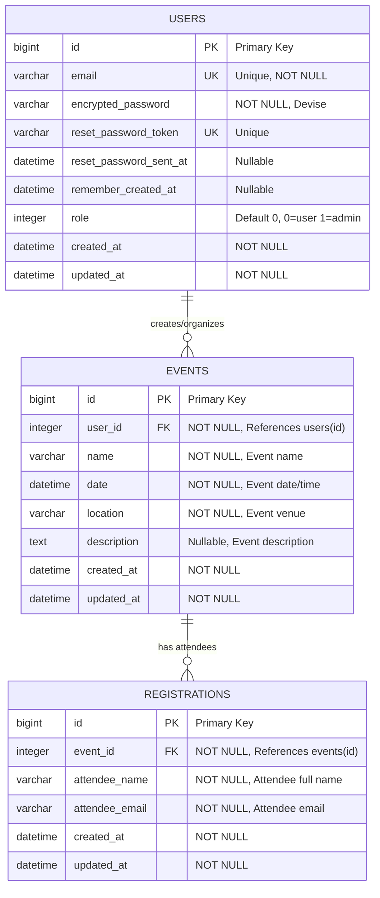
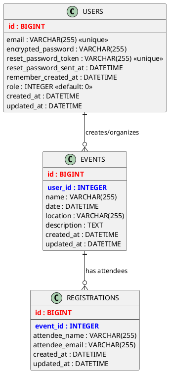

# Visual ERD - Mermaid Diagram
## Rails Event Management System

You can copy this Mermaid code and paste it into any Mermaid-compatible viewer (like GitHub, Mermaid Live Editor, or VS Code with Mermaid extension):

### Alternative PlantUML ERD

If you prefer PlantUML format:

### How to View These Diagrams:

1. **Mermaid**:
   - Visit [Mermaid Live Editor](https://mermaid.live/)
   - Paste the Mermaid code above
   - View/export the generated diagram

2. **PlantUML**:
   - Visit [PlantUML Server](http://www.plantuml.com/plantuml/uml/)
   - Paste the PlantUML code above
   - Generate and download the diagram

3. **VS Code**:
   - Install "Mermaid Markdown Syntax Highlighting" extension
   - Open this file and preview it

4. **GitHub**:
   - GitHub natively supports Mermaid diagrams in markdown files
   - The diagram will render automatically when viewing this file on GitHub

### Quick Database Stats:
- **3 Tables** with clear relationships
- **2 Foreign Key relationships** ensuring data integrity  
- **4 Indexes** for optimal query performance
- **Role-based access control** built into the User model
- **Cascade deletions** for maintaining referential integrity

---

*These visual diagrams complement the detailed ERD documentation in `ERD.md`*
