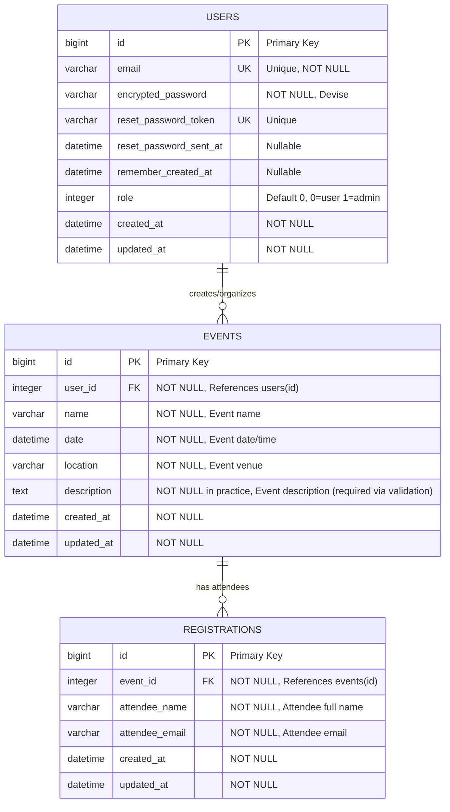
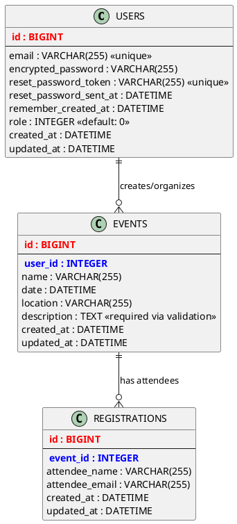

# Visual ERD - Mermaid Diagram
## Rails Event Management System

**Current Schema Version**: `2025_09_16_073900` (PostgreSQL)  
**Last Updated**: September 16, 2025

You can copy this Mermaid code and paste it into any Mermaid-compatible viewer (like GitHub, Mermaid Live Editor, or VS Code with Mermaid extension):

### Alternative PlantUML ERD

If you prefer PlantUML format:

### How to View These Diagrams:

1. **Mermaid**:
   - Visit [Mermaid Live Editor](https://mermaid.live/)
   - Paste the Mermaid code above
   - View/export the generated diagram

2. **PlantUML**:
   - Visit [PlantUML Server](http://www.plantuml.com/plantuml/uml/)
   - Paste the PlantUML code above
   - Generate and download the diagram

3. **VS Code**:
   - Install "Mermaid Markdown Syntax Highlighting" extension
   - Open this file and preview it

4. **GitHub**:
   - GitHub natively supports Mermaid diagrams in markdown files
   - The diagram will render automatically when viewing this file on GitHub

### Enhanced Features & Model Details:

#### User Model Enhancements:
- **Role-based access control**: `admin?` and `user?` methods
- **Default role assignment**: Automatic role=0 (user) for new records
- **Admin privileges**: Admin users can view/manage all events
- **Devise integration**: Full authentication with email/password

#### Event Model Enhancements:
- **Required description**: Now validated as required field
- **Custom validation messages**: User-friendly error messages
- **Scoped access**: `for_user` scope respects admin vs regular user permissions
- **Dependent destroy**: Cascades to registrations when event deleted

#### Registration Model Enhancements:
- **Email format validation**: Validates proper email format
- **Custom validation messages**: Improved user experience
- **Belongs to event**: Strong referential integrity

### Quick Database Stats:
- **3 Tables** with clear relationships
- **2 Foreign Key relationships** ensuring data integrity  
- **5 Indexes** for optimal query performance (including PostgreSQL indexes)
- **Role-based access control** built into the User model
- **Cascade deletions** for maintaining referential integrity
- **PostgreSQL database** with proper constraints and indexes
- **PostgreSQL Extensions**: `plpgsql` enabled for advanced functionality

### Administrative Features:
- **Admin Dashboard**: Separate admin interface for managing all events and registrations
- **Bulk Operations**: Bulk delete events and registrations with confirmation
- **CSV Export**: Export all or selected registrations to CSV format
- **Advanced Search**: Search and filter events and registrations
- **User Management**: Role-based access (admin vs regular users)
- **Statistics**: Dashboard with key metrics and counts

### Recent Database Migrations:
- **2025-09-16**: Updated existing events to ensure all have descriptions
- **PostgreSQL Migration**: Switched from SQLite to PostgreSQL for production deployment
- **Validation Enhancements**: Added required description validation

---

*These visual diagrams complement the detailed ERD documentation in `ERD.md`*
